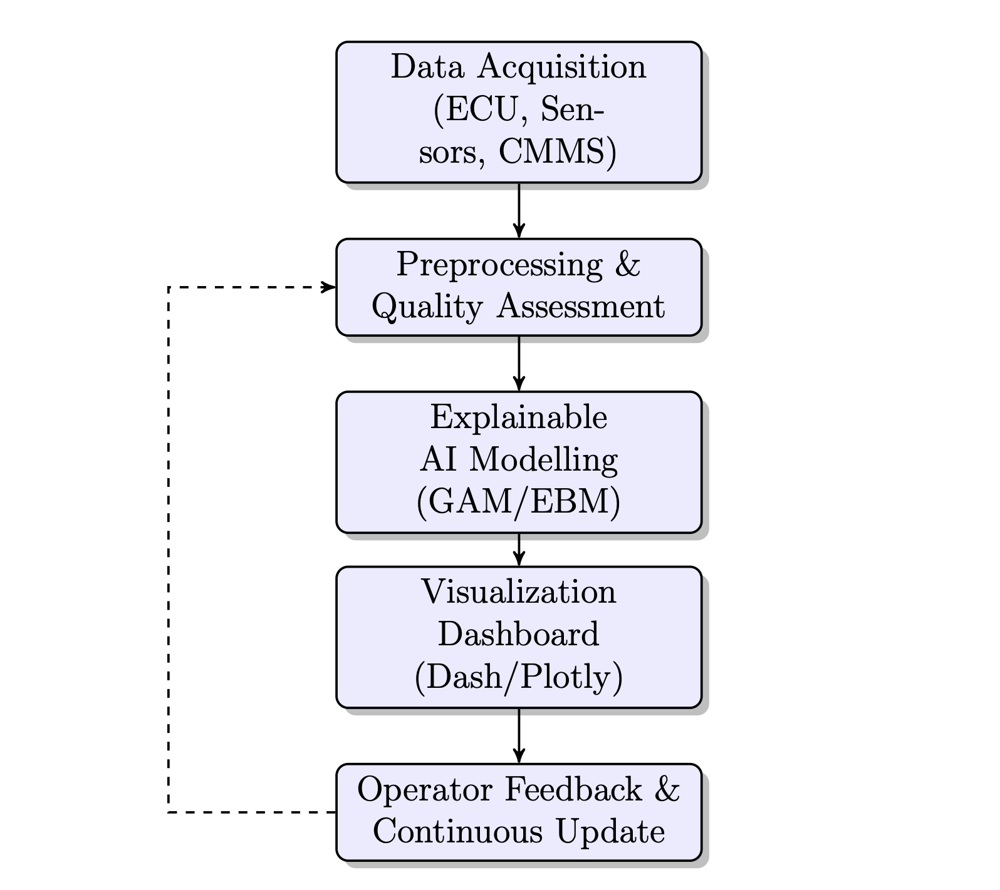

## Project Overview

In the maritime industry, auxiliary systems—specifically diesel generators—are the backbone of operational reliability and safety. However, most vessels operate within legacy Information and Operational Technology (IT/OT) environments where data is abundant but remains "siloed" and underutilized. Current Engine Health Monitoring (EHM) systems are often proprietary to a single OEM, leaving mixed-fleet operators without integrated, transparent analytics.

This Professional Doctorate project at the **Amsterdam University of Applied Sciences (AUAS)** develops an **Explainable Predictive Maintenance (PdM)** prototype. Unlike traditional "black-box" AI, this research integrates explainability metrics directly into the operator's decision workflow, creating verifiable and auditable maintenance insights aligned with emerging maritime certification standards such as the EU AI Act and DNV requirements.

### The Interpretability Framework

A critical challenge in safety-critical maritime environments is trust. This project builds on established experience in the aviation domain to translate high-stakes predictive modeling into the maritime context. By using interpretable AI techniques, the system reveals _why_ a maintenance action is recommended, rather than just providing a binary alert.

- **Explainable Boosting Machines (EBM):** These models identify specific contributing factors—such as sustained overload or coolant temperature variance—to fault likelihoods.
- **Generalized Additive Models (GAM):** Used to capture non-linear degradation patterns while remaining transparent to the human operator.
- **Legacy Data Optimization:** The workflow is designed to operate on existing shipboard datasets (ECU, SCADA, and Alarm logs) without requiring expensive sensor retrofits.

### System Architecture

The prototype is structured into five functional layers to support a traceable data flow from legacy hardware to the end-user dashboard:

1.  **Data Ingestion:** Python-based connectors (SQLAlchemy, pandas) extract data from Alarm Monitoring Systems (AMS) and Engine Control Units (ECU).
2.  **Preprocessing:** Automated data cleaning and time-alignment to aggregate fragmented logs into engineering parameters.
3.  **XAI Modeling:** Feature selection and explainability mapping to identify the Remaining Useful Life (RUL) and health indices.
4.  **Visualization:** A localized **Dash/Plotly** dashboard presenting interpretable diagnostics to both ship and shore personnel.
5.  **Operator Feedback:** A "human-in-the-loop" cycle that allows marine engineers to refine model thresholds, ensuring continuous improvement.

<em>Figure 2: Five-layer architecture for the explainable predictive maintenance prototype</em>

### Industry Impact & Value Proposition

This research provides a validated roadmap for scalable digital transformation across mixed-OEM maritime fleets.

  <table style="width: 100%; table-layout: fixed; border-collapse: collapse; font-size: 0.95em;">
    <thead>
      <tr style="background-color: var(--light-navy); border-bottom: 2px solid var(--green);">
        <th style="width: 35%; text-align: left; padding: 20px; color: var(--green);">Impact Area</th>
        <th style="width: 65%; text-align: right; padding: 20px; color: var(--green);">Expected Benefit to Partners</th>
      </tr>
    </thead>
    <tbody>
      <tr style="border-bottom: 1px solid var(--lightest-navy);">
        <td style="text-align: left; padding: 20px;">Operational Reliability</td>
        <td style="text-align: right; padding: 20px;">Early detection of degradation, improving planning and reducing unexpected downtime.</td>
      </tr>
      <tr style="border-bottom: 1px solid var(--lightest-navy);">
        <td style="text-align: left; padding: 20px;">Maintenance Efficiency</td>
        <td style="text-align: right; padding: 20px;">Optimized scheduling and spare-parts logistics integrated with existing CMMS.</td>
      </tr>
      <tr style="border-bottom: 1px solid var(--lightest-navy);">
        <td style="text-align: left; padding: 20px;">Sustainability</td>
        <td style="text-align: right; padding: 20px;">Support for optimized generator loading and fuel efficiency via condition-based support.</td>
      </tr>
      <tr>
        <td style="text-align: left; padding: 20px;">Certification Readiness</td>
        <td style="text-align: right; padding: 20px;">Transparent AI logic aligned with DNV and EU AI Act compliance standards.</td>
      </tr>
    </tbody>
  </table>

---

### Project Documentation

The full Executive Summary, including research phases and industry involvement guidelines, is available for review.

<a class="email-link" href="/portfolio/Professional_Doctorate_Final_Executive_Summary.pdf" target="_blank" rel="noreferrer">
  View Executive Summary (PDF)
</a>
