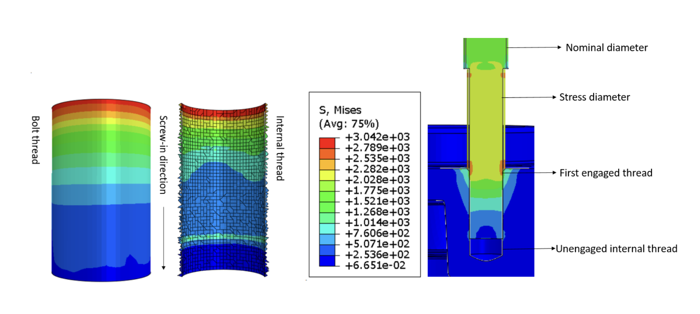

# Automated FEA Strength Verification of Bolted Joints

Developed a **14-step automated ABAQUS Python workflow** for the verification of safety-critical bolted joints in Electronic Power Steering (EPS) systems.

✔ **90% reduction** in manual verification time  
✔ **<0.5% deviation** from physical tests  
✔ **100% conservative** design validation  
✔ Enabled faster design iterations for production systems

<em>Figure 1: Identification of critical bolted joint locations in steering housing assemblies</em>

---

## Project Overview

Bolted joints in **Electronic Power Steering (EPS)** systems are safety-critical and experience complex dynamic loads. Traditional **VDI 2230** calculations rely on simplified assumptions and are difficult to scale for complex geometries.

This project modernized the verification process by combining **high-fidelity finite element analysis**, **automated post-processing**, and **custom ABAQUS plug-in development** to create a scalable and validated workflow.

---

## Automation Workflow

The core of this project was the development of a custom **ABAQUS Plug-In** using the **Python API**.

The workflow automates a rigorous **14-step engineering pipeline**, ensuring consistency across design iterations:

- **Multi-Model Transition**  
  Transition from high-complexity **Model Class III** to simplified **Model Class I** for standardized verification.

- **Load Case Automation**  
  Integrated handling of preload, thermal effects, and operational loads into a unified workflow.

- **Automated Verification Logic**  
  Automatic extraction of history and field outputs for:
  - Working stress
  - Assembly stress
  - Minimum length of engagement
  - Pull-out safety verification

<em>Figure 2: Workflow logic for the ABAQUS automation plug-in</em>

---

## Validation & Correlation

The automated workflow was benchmarked against classical **VDI 2230** analytical calculations using a connecting rod test case.

The results demonstrated near-perfect correlation, validating the script’s ability to replace manual calculations for complex parts.

  <table style="width: 100%; table-layout: fixed; border-collapse: collapse; font-size: 0.95em;">
    <thead>
      <tr style="background-color: var(--light-navy); border-bottom: 2px solid var(--green);">
        <th style="width: 40%; text-align: left; padding: 20px; color: var(--green);">Quantity</th>
        <th style="width: 20%; text-align: center; padding: 20px; color: var(--green);">VDI 2230</th>
        <th style="width: 20%; text-align: center; padding: 20px;">FEM Script</th>
        <th style="width: 20%; text-align: right; padding: 20px;">Difference</th>
      </tr>
    </thead>
    <tbody>
      <tr style="border-bottom: 1px solid var(--lightest-navy);">
        <td style="text-align: left; padding: 20px;">Min required clamp load</td>
        <td style="text-align: center; padding: 20px;">16267 N</td>
        <td style="text-align: center; padding: 20px;">16155 N</td>
        <td style="text-align: right; padding: 20px; color: var(--green);"><strong>-0.69%</strong></td>
      </tr>
      <tr style="border-bottom: 1px solid var(--lightest-navy);">
        <td style="text-align: left; padding: 20px;">Embedding loss</td>
        <td style="text-align: center; padding: 20px;">1103 N</td>
        <td style="text-align: center; padding: 20px;">1101 N</td>
        <td style="text-align: right; padding: 20px; color: var(--green);"><strong>-0.20%</strong></td>
      </tr>
      <tr>
        <td style="text-align: left; padding: 20px;">Safety margin</td>
        <td style="text-align: center; padding: 20px;">1.43</td>
        <td style="text-align: center; padding: 20px;">1.42</td>
        <td style="text-align: right; padding: 20px; color: var(--green);"><strong>+0.70%</strong></td>
      </tr>
    </tbody>
  </table>

<em>Figure 3: Experimental validation through pull-out testing</em>

---

## Fail-Safe Material Model Calibration

A critical finding of the research addressed the **non-conservative behavior** of **AlSi12 aluminum alloys** in stripping failure calculations.

To ensure fail-safe design, experimental results were used to derive a hardness-based shear limit relation:

<strong>τB / HB = 1.5</strong>

By integrating this into the verification logic, the workflow achieved:

✔ **100% conservativeness**  
✔ Reliable lower-bound structural integrity prediction  
✔ Improved confidence for mass-production steering assemblies

<em>Figure 4: FEM and experimental comparison for conservative failure prediction</em>

---

## Engineering Insights

The project also provided detailed insights into local stress distributions and thread engagement behavior.

<em>Figure 5: Thread stress distribution and identification of critical zones</em>

---

## Key Takeaway

This project transformed a manual, approximation-based engineering verification process into a **scalable**, **validated**, and **production-ready automation workflow** for safety-critical automotive applications.
