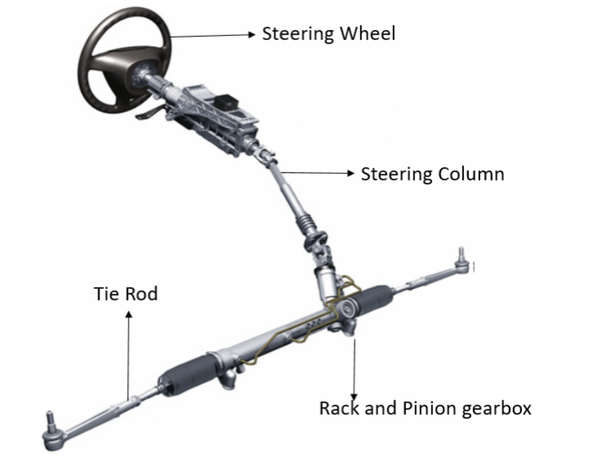
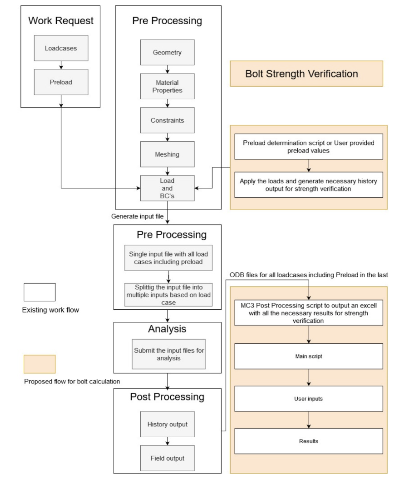
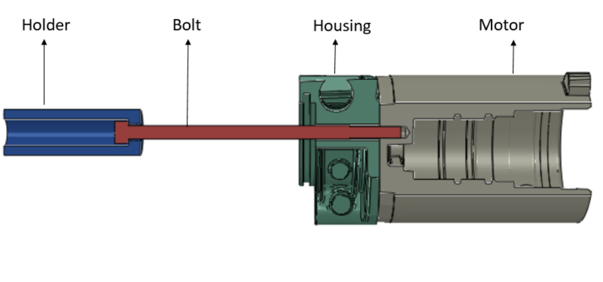
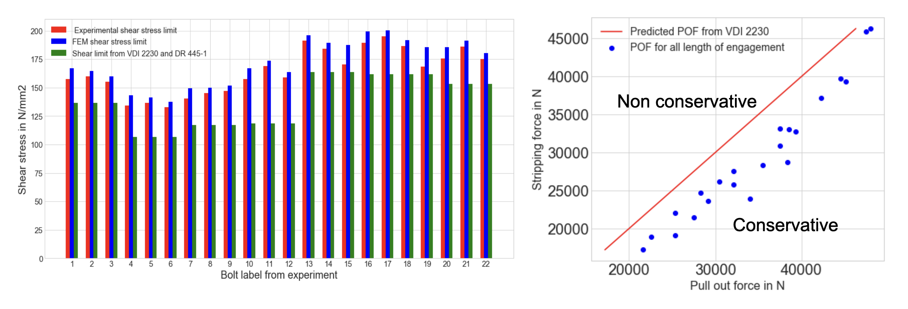

## Project Overview

In Electronic Power Steering (EPS) systems, bolted joints are safety-critical components subject to complex dynamic loads. Traditional analytical verification according to the **VDI 2230** standard often relies on significant approximations for complex geometries. This research modernized the verification process by developing a model-based FEM approach that captures localized stress distributions and clamping force behavior with high precision.

<em>Figure 1: Identification of critical bolted joint locations in steering housing assemblies</em>

### High-Fidelity Automation Workflow

The core of this project was the development of a custom **ABAQUS Plug-In** using the Python API. This tool automates a rigorous 14-step engineering pipeline, ensuring consistency across various design iterations:

- **Multi-Model Transition:** The workflow handles the transition from high-complexity **Model Class III** (capturing full geometric interaction) to simplified **Model Class I** (standardized analysis) to perform precise safety checks.
- **Load Case Automation:** Integrated handling of assembly preloads, thermal effects, and operational load cases into a single input stream.
- **Verification Logic:** Automated extraction of field and history outputs to verify working stress, assembly stress, and minimum length of engagement.

<em>Figure 2: Workflow logic for the ABAQUS automation plug-in</em>

### Engineering Validation

The accuracy of the automated FEA script was verified against classical VDI 2230 analytical calculations using a connecting rod benchmark. The results demonstrated a near-perfect correlation, validating the script’s ability to replace manual calculations for complex parts.

  <table style="width: 100%; table-layout: fixed; border-collapse: collapse; font-size: 0.95em;">
    <thead>
      <tr style="background-color: var(--light-navy); border-bottom: 2px solid var(--green);">
        <th style="width: 40%; text-align: left; padding: 20px; color: var(--green);">Quantity</th>
        <th style="width: 20%; text-align: center; padding: 20px; color: var(--green);">Analytical (VDI 2230)</th>
        <th style="width: 20%; text-align: center; padding: 20px 20px 20px 60px; color: var(--green);">FEM-based Script</th>
        <th style="width: 20%; text-align: right; padding: 20px; color: var(--green);">Relative Change</th>
      </tr>
    </thead>
    <tbody>
      <tr style="border-bottom: 1px solid var(--lightest-navy);">
        <td style="text-align: left; padding: 20px;">Min required clamp load (FKQ)</td>
        <td style="text-align: center; padding: 20px; font-family: var(--font-mono);">16267 N</td>
        <td style="text-align: center; padding: 20px 20px 20px 60px; font-family: var(--font-mono);">16155.43 N</td>
        <td style="text-align: right; padding: 20px; font-family: var(--font-mono); color: var(--green);"><strong>-0.69%</strong></td>
      </tr>
      <tr style="border-bottom: 1px solid var(--lightest-navy);">
        <td style="text-align: left; padding: 20px;">Embedding (fz)</td>
        <td style="text-align: center; padding: 20px; font-family: var(--font-mono);">1103 N</td>
        <td style="text-align: center; padding: 20px 20px 20px 60px; font-family: var(--font-mono);">1100.89 N</td>
        <td style="text-align: right; padding: 20px; font-family: var(--font-mono); color: var(--green);"><strong>-0.20%</strong></td>
      </tr>
      <tr>
        <td style="text-align: left; padding: 20px;">Safety margin working stress (SF)</td>
        <td style="text-align: center; padding: 20px; font-family: var(--font-mono);">1.43</td>
        <td style="text-align: center; padding: 20px 20px 20px 60px; font-family: var(--font-mono);">1.42</td>
        <td style="text-align: right; padding: 20px; font-family: var(--font-mono); color: var(--green);"><strong>+0.70%</strong></td>
      </tr>
    </tbody>
  </table>

<em>Figure 3: Physical validation through pull-out testing to establish failure limits</em>

### Material Hardness & 100% Conservativeness

A critical finding of the research addressed the non-conservative behavior of AlSi12 aluminum alloys. To ensure a fail-safe design, the workflow was refined using experimental data to establish a hardness-based shear limit relationship:

<strong>&tau;B / HB = 1.5</strong>

By integrating this correlation into the minimum length of engagement calculation, the tool achieved **100% conservativeness**. This refinement ensures that the automated verification consistently identifies the lower bound of structural integrity, providing a reliable safety margin for mass-production steering assemblies.

<em>Figure 4: Validation of FEM results with experimental and checking for the conservativeness of the model</em>

