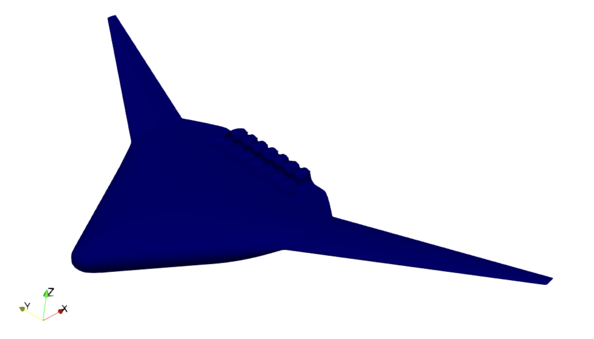
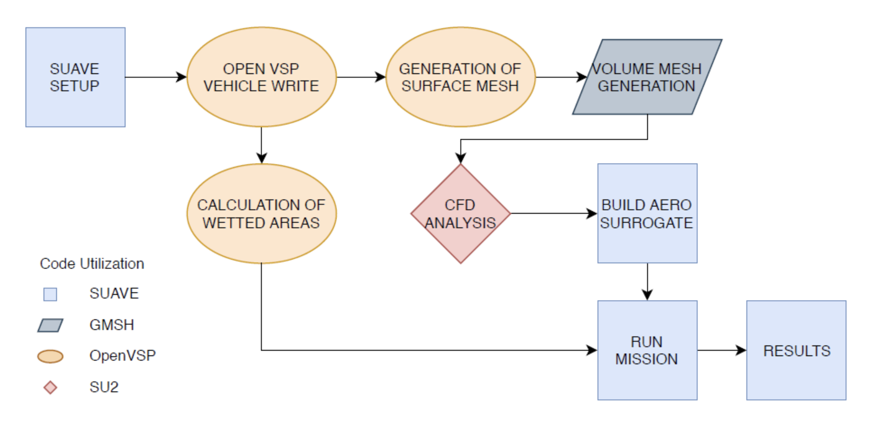
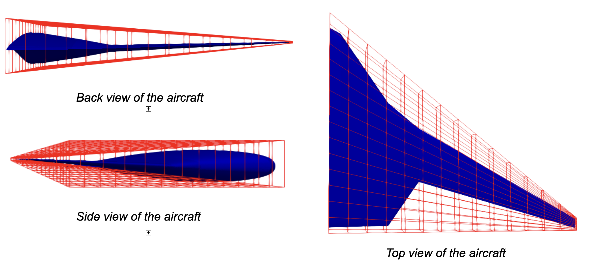
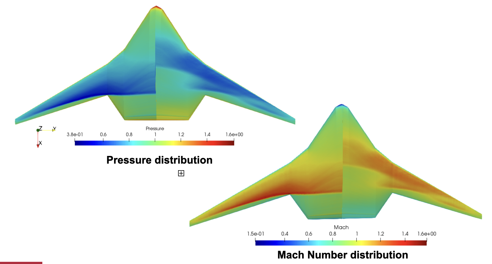
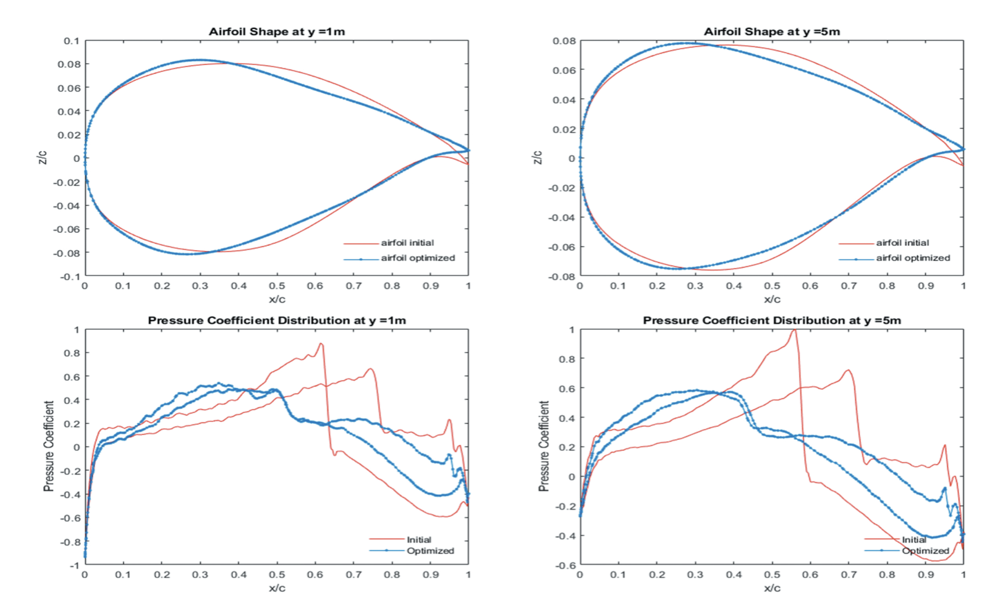
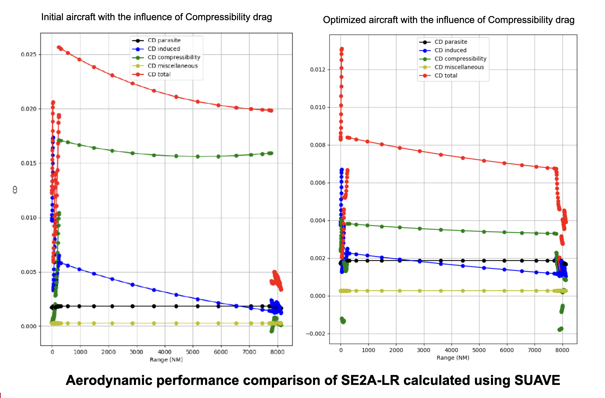

# Multi-Fidelity Aerodynamic Shape Optimization of a BWB Aircraft

Designed an **automated multi-fidelity aerodynamic optimization framework** for a Long Range Blended Wing Body (BWB) aircraft.

✔ **75.95% drag reduction**  
✔ **38.96% MTOW reduction**  
✔ **35.96% fuel efficiency improvement**  
✔ **8000 NM mission-level validation**

<em>Figure 1: Baseline geometry of the Long Range BWB aircraft</em>

---

## Project Overview

Traditional low-fidelity mission analysis tools struggle to capture **transonic aerodynamic effects** such as shock formation and compressibility drag.

This project bridges conceptual aircraft design and **high-fidelity CFD-based optimization**, enabling faster iteration with improved aerodynamic accuracy.

---

## Multi-Fidelity Toolchain

The automated workflow integrates multiple engineering tools:

- **SUAVE** → mission sizing, fuel burn, and performance analysis
- **OpenVSP** → parametric geometry generation
- **GMSH** → mesh generation
- **SU2** → high-fidelity RANS CFD simulation
- **Python** → workflow automation and optimization control

<em>Figure 2: Automated multi-fidelity optimization workflow</em>

---

## Geometry Parameterization

Implemented **Free Form Deformation (FFD)** to enable global aircraft shape morphing without manual remodeling.

This allowed optimization of:

- Wing twist
- Airfoil variation
- Leading/trailing edge deformation
- Fuselage-wing blending

<em>Figure 3: FFD lattice used for geometry control</em>

---

## Performance Improvements

The optimized design significantly reduced aerodynamic drag and improved mission-level efficiency.

  <table style="width: 100%; table-layout: fixed; border-collapse: collapse; font-size: 0.95em;">
    <thead>
      <tr style="background-color: var(--light-navy); border-bottom: 2px solid var(--green);">
        <th style="width: 60%; text-align: left; padding: 20px; color: var(--lightest-slate);">Metric</th>
        <th style="width: 40%; text-align: right; padding: 20px; color: var(--lightest-slate);">Improvement</th>
      </tr>
    </thead>
    <tbody>
      <tr style="border-bottom: 1px solid var(--lightest-navy);">
        <td style="text-align: left; padding: 20px;">Total Drag Coefficient</td>
        <td style="text-align: right; padding: 20px; font-family: var(--font-mono); color: var(--green);"><strong>-75.95%</strong></td>
      </tr>
      <tr style="border-bottom: 1px solid var(--lightest-navy);">
        <td style="text-align: left; padding: 20px;">Maximum Take-Off Weight</td>
        <td style="text-align: right; padding: 20px; font-family: var(--font-mono); color: var(--green);"><strong>-38.96%</strong></td>
      </tr>
      <tr>
        <td style="text-align: left; padding: 20px;">Fuel Efficiency</td>
        <td style="text-align: right; padding: 20px; font-family: var(--font-mono); color: var(--green);"><strong>+35.96%</strong></td>
      </tr>
    </tbody>
  </table>

<em>Figure 4: Optimized pressure distribution across the airframe</em>

<em>Figure 5: Pressure coefficient comparison across spanwise sections</em>

---

## Mission-Level Validation

The optimized aircraft was evaluated over an **8000 NM mission profile**.

Results showed:

- Lower compressibility drag
- Better lift-to-drag ratio
- Improved cruise efficiency
- Lower fuel consumption

<em>Figure 6: Mission performance comparison across full range</em>

---

## Key Takeaway

This project demonstrates how **multi-fidelity optimization workflows** can combine rapid conceptual design with high-fidelity aerodynamic precision to achieve substantial performance gains in next-generation aircraft design.
